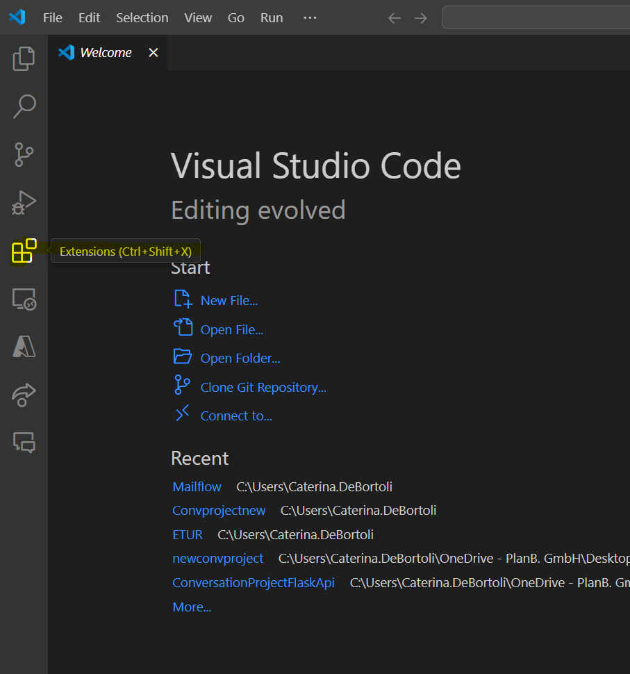
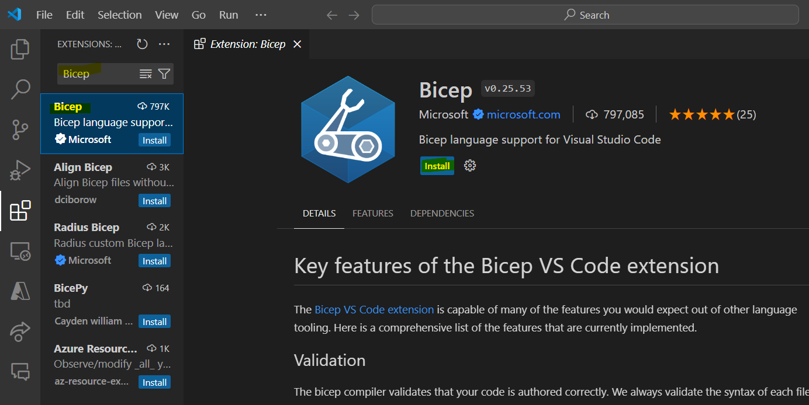
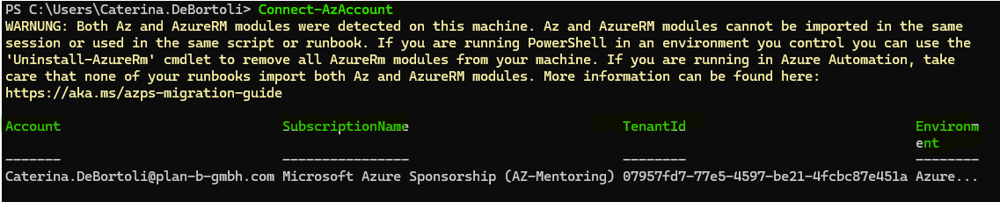
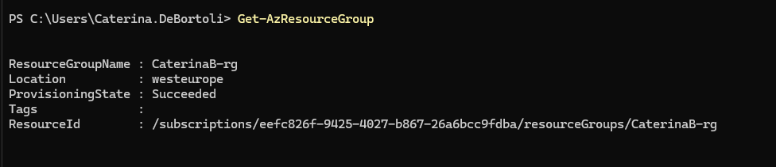
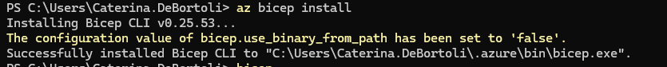
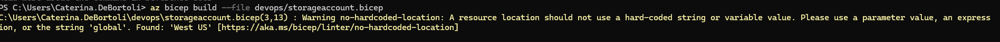
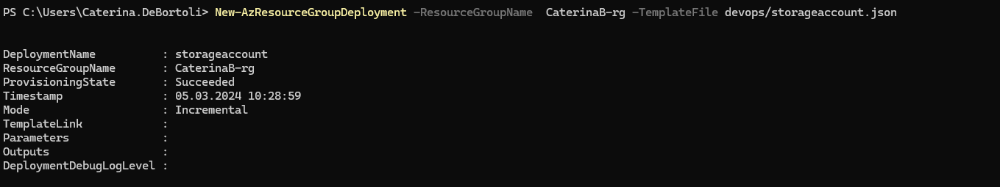
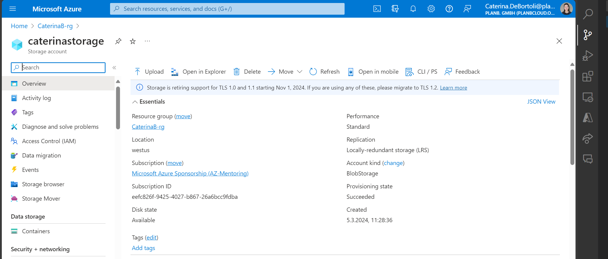
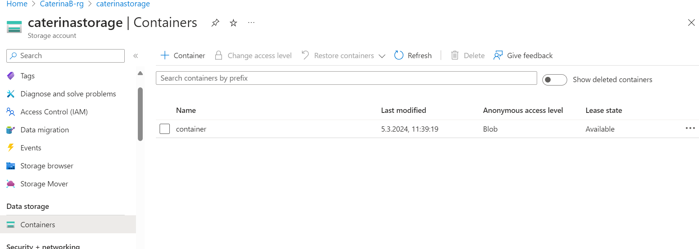
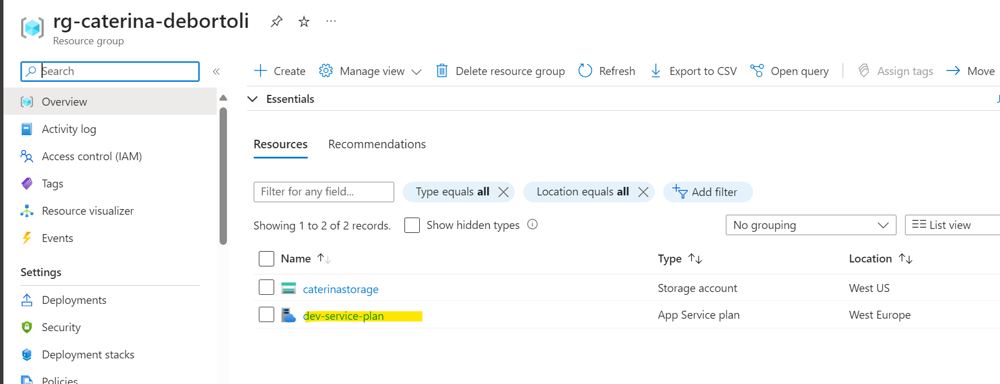

#     DevOps
#### Devops practices enable development and operations teams to conceive, build and deliver secure software at top speed, through automation, collaboration, fast feedback, and iterative improvement. 

#### CI 
Continuous integration is the practice of integrating all your code changes into the main branch of a shared source code repository early and often, automatically testing each change when you commit or merge them, and automatically kicking off a build. With continuous integration, errors and security issues can be identified and fixed more easily, and much earlier in the development process.

By merging changes frequently and triggering automatic testing and validation processes, you minimize the possibility of code conflict, even with multiple developers working on the same application. A secondary advantage is that you don't have to wait long for answers and can, if necessary, fix bugs and security issues while the topic is still fresh in your mind.

Common code validation processes start with a static code analysis that verifies the quality of the code. Once the code passes the static tests, automated CI routines package and compile the code for further automated testing. CI processes should have a version control system that tracks changes so you know the version of the code used.

#### CD
Continuous delivery is a software development practice that works in conjunction with CI to automate the infrastructure provisioning and application release process.

Once code has been tested and built as part of the CI process, CD takes over during the final stages to ensure it's packaged with everything it needs to deploy to any environment at any time. CD can cover everything from provisioning the infrastructure to deploying the application to the testing or production environment.

With CD, the software is built so that it can be deployed to production at any time. Then you can trigger the deployments manually or move to continuous deployment, where deployments are automated as well.
Continuous deployment enables organizations to deploy their applications automatically, eliminating the need for human intervention. With continuous deployment, DevOps teams set the criteria for code releases ahead of time and when those criteria are met and validated, the code is deployed into the production environment. This allows organizations to be more nimble and get new features into the hands of users faster.

#### IoT (Internet of Things)
The Internet of Things (IoT) describes the network of physical objects—“things”—that are embedded with sensors, software, and other technologies for the purpose of connecting and exchanging data with other devices and systems over the internet.
For example Smart home devices, smartwatches, pacemakers, self-driving cars

#### Bicep
Bicep is a domain-specific language (DSL) that uses declarative syntax to deploy Azure resources. In a Bicep file, you define the infrastructure you want to deploy to Azure, and then use that file throughout the development lifecycle to repeatedly deploy your infrastructure. Your resources are deployed in a consistent manner.
Bicep provides concise syntax, reliable type safety, and support for code reuse. Bicep offers a first-class authoring experience for your infrastructure-as-code solutions in Azure.

#### Azure Subscription

Every Azure AD tenant may have multiple Azure subscriptions. The grade of subscription at which the consumer invoiced is depending on consumption. In addition, it enables a logical separation for administrative simplification. A firm can ordinarily have a primary tenant, and each of its cloud-using divisions can have multiple subscriptions for their individual Azure account environments.

#### Azure Resource Groups
A resource group is a container that holds related resources for an Azure solution. The resource group can include all the resources for the solution, or only those resources that you want to manage as a group. One benefit of using RGs in Azure is grouping related resources that belong to an application together, as they share a unified lifecycle from creation to usage and finally, de-provisioning.

#### Blob Storage Type
A "blob," which is short for Binary Large Object, is a mass of data in binary form that does not necessarily conform to any file format. 
That is what Blob storage is optimized for storing this type of data, serving images or documents directly to a browser, storing files for distributed access, streaming video and audio, writing to log files, storing data for backup and restore, disaster recovery, and archiving, storing data for analysis by an on-premises or Azure-hosted service.

#### Git- Source Control
##### 1. Pull Request
A pull request is a proposal to merge a set of changes from one branch into another. In a pull request, collaborators can review and discuss the proposed set of changes before they integrate the changes into the main codebase. Pull requests display the differences, or diffs, between the content in the source branch and the content in the target branch.

##### 2. Branch
In Git, a branch is a pointer to one specific commit. A parallel version of your code that is contained within the repository, but does not affect the primary or main branch.
Branches allow you to work on different parts of a project without impacting the main branch.
When the work is complete, a branch can be merged with the main project.
You can even switch between branches and work on different projects without them interfering with each other.

##### 3. Commit
A commit is a snapshot of your repository at a specific point in time.
Adding commits keep track of our progress and changes as we work. Git considers each commit change point or "save point". It is a point in the project you can go back to if you find a bug, or want to make a change.
When we commit, we should always include a message.
By adding clear messages to each commit, it is easy for yourself (and others) to see what has changed and when.

#### GitHub
##### 1. Repository
A repository is the most basic element of GitHub. It's a place where you can store your code, your files, and each file's revision history. Repositories can have multiple collaborators and can be either public or private.

##### 2. Action
GitHub Actions is a continuous integration and continuous delivery (CI/CD) platform that allows you to automate your build, test, and deployment pipeline. You can create workflows that build and test every pull request to your repository, or deploy merged pull requests to production.
GitHub Actions goes beyond just DevOps and lets you run workflows when other events happen in your repository. For example, you can run a workflow to automatically add the appropriate labels whenever someone creates a new issue in your repository.
You can configure a GitHub Actions workflow to be triggered when an event occurs in your repository, such as a pull request being opened or an issue being created. Your workflow contains one or more jobs which can run in sequential order or in parallel. Each job will run inside its own virtual machine runner, or inside a container, and has one or more steps that either run a script that you define or run an action, which is a reusable extension that can simplify your workflow.

##### 3. Service Principal - Azure Deployment
Service principals serve as the application’s identity in Azure DevOps, where we track what permissions it has in each organization, project, team, etc. 
They allow you to connect to resources that support Azure AD authentication, but they eliminate the need for developers to manage any credentials.

#### TASK 1
- Install Visual Studio Code and Bicep for Resource Templates

  
- Understand Bicep [Bicep language for deploying Azure resources - Azure Resource Manager | Microsoft Docs](https://learn.microsoft.com/en-us/azure/azure-resource-manager/bicep/overview?tabs=bicep)
- Install Powershell Core with Azure Extension:
  [Installing PowerShell on Windows - PowerShell | Microsoft Docs ](https://learn.microsoft.com/en-us/powershell/scripting/install/installing-powershell-on-windows?view=powershell-7.2)
  [Install the Azure Az PowerShell module | Microsoft Docs ](https://learn.microsoft.com/en-us/powershell/azure/install-azure-powershell?view=azps-11.3.0&viewFallbackFrom=azps-8.2.0)
  
      Install-Module -Name Az -Repository PSGallery -Force -AllowClobber
  
- Authenticate with Azure to your Subscription and Resource Group
  
      Connect-AzAccount

  

- Your Resource Groups

      Get-AzResourceGroup

 
#### TASK 2:  
- Create your first Template for a Storage Account: [Microsoft.Storage/storageAccounts - Bicep, ARM template & Terraform AzAPI reference | Microsoft Docs](https://learn.microsoft.com/en-us/azure/templates/microsoft.storage/storageaccounts?pivots=deployment-language-bicep)

[BICEP STORAGE ACCOUNT](storageaccount.bicep)

[ARM TEMPLATE STORAGE ACCOUNT](storageaccount.json)

- The Template should have a Parameter for the Name of the Storage Account  
- Deploy the Template to your Resource Group with PowerShell

- Extend the Template to create a blob Container
  

#### Userstory 1: 
As a User I want to be able to access the application on all my devices without the need of an installation.  
Therefore, I would use my browser and we need to create a resource to host a website.  
Task 1: Find a Resource to host a website on it 

[Azure App Service](https://learn.microsoft.com/en-us/azure/app-service/overview)

Task 2: Create a Resource Template for it 

[Resource Template](Userstory1/appservice.json)

Task 3: Create Parameter Files for dev, test and prod resources 

[Dev parameter file](Userstory1/dev_parameters.yaml)

[Test parameter file](Userstory1/test_parameters.yaml)

[Prod parameter file](Userstory1/prod_parameters.yaml)

Task 4: Write a PowerShell Script to deploy all stages. You want to only deploy one stage per execution (./createWebApp.ps1 -Environment dev) 

[Powershell Script](Userstory1/createWebApp.ps1)

 -           ./createWebApp.ps1 -Environment dev

 -           ./createWebApp.ps1 -Environment prod

 -           ./createWebApp.ps1 -Environment test

Task 5: short documentation why you choose the resource and what other options you found. Compare the different Features 

| Balanced Hosting Solution | Simplified Hosting Solution |
| --- | --- |
| Azure App Service | Azure Static Web Apps |
| Always runs in an App Service plan. In addition, Azure Functions also has the option of running in an App Service plan. An App Service plan defines a set of compute resources for a web app to run. When you create an App Service plan in a certain region (for example, West Europe), a set of compute resources is created for that plan in that region. Whatever apps you put into this App Service plan run on these compute resources as defined by your App Service plan. Each App Service plan defines: Operating System (Windows, Linux) Region (West US, East US, and so on) Number of VM instances Size of VM instances (Small, Medium, Large) Pricing tier (Free, Shared, Basic, Standard, Premium, PremiumV2, PremiumV3, Isolated, IsolatedV2) | Low-code hosting solutions are designed to allow you to bring your code functionality without having to manage the application infrastructure. |

I chose App Service because I think it is the service which provides the most flexibility to host a web app and with it you do not need to worry about the infrastructure of your app.

[Other resources](https://learn.microsoft.com/en-us/azure/developer/intro/hosting-apps-on-azure)
