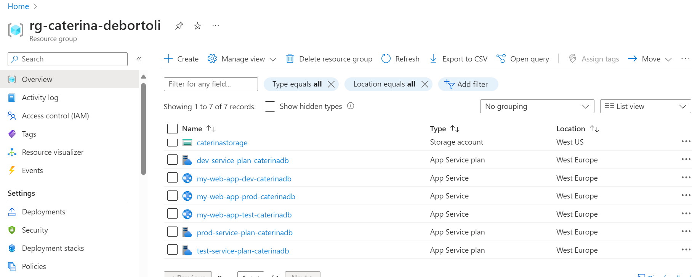

#     DevOps
#### Devops practices enable development and operations teams to conceive, build and deliver secure software at top speed, through automation, collaboration, fast feedback, and iterative improvement. 

#### CI 
Continuous integration is about regularly combining code changes into the primary branch of a shared repository, while automatically testing each change for errors and security flaws. This process ensures that issues are identified and addressed promptly, reducing the risk of conflicts, especially in projects with multiple developers. Additionally, it enables quick bug fixes and security updates, maintaining code quality throughout development. Key validation steps include static code analysis, automated compilation, and testing, all facilitated by version control to track code changes effectively.

#### CD
Continuous delivery (CD) complements continuous integration (CI) by automating the setup of infrastructure and the release process for software applications. Once the code has been thoroughly tested and built through CI, CD takes charge of preparing it for deployment to any environment. This includes packaging the code with all necessary components for deployment, be it in testing or production environments.

In essence, CD ensures that software is ready for deployment at any time, giving teams the flexibility to trigger deployments manually or move towards continuous deployment, where releases are automated. Continuous deployment further streamlines the process by allowing organizations to automatically deploy code to production once predefined criteria are met and validated. This approach accelerates the delivery of new features to users, enhancing organizational agility.

#### IoT (Internet of Things)
The Internet of Things (IoT) describes the network of physical objects—“things”—that are embedded with sensors, software, and other technologies for the purpose of connecting and exchanging data with other devices and systems over the internet.
For example Smart home devices, smartwatches, pacemakers, self-driving cars

#### Bicep
Bicep is a domain-specific language (DSL) that uses declarative syntax to deploy Azure resources. In a Bicep file, you define the infrastructure you want to deploy to Azure, and then use that file throughout the development lifecycle to repeatedly deploy your infrastructure. Your resources are deployed in a consistent manner.

#### Azure Subscription

Each Azure Active Directory (AD) tenant can contain several Azure subscriptions. This setup allows for easier management and organization. Typically, a company will have a main tenant, and each department or division that uses cloud services will have its own Azure subscriptions tailored to its specific needs.

#### Azure Resource Groups
A resource group is a container that holds related resources for an Azure solution. The resource group can include all the resources for the solution, or only those resources that you want to manage as a group. One benefit of using RGs in Azure is grouping related resources that belong to an application together, as they share a unified lifecycle from creation to usage and finally, de-provisioning.

#### Blob Storage Type
A "blob," which is short for Binary Large Object, is a mass of data in binary form that does not necessarily conform to any file format. 
Blob storage is optimized for storing this type of data, serving images or documents directly to a browser, storing files for distributed access, streaming video and audio, writing to log files, storing data for backup and restore, disaster recovery, and archiving, storing data for analysis by an on-premises or Azure-hosted service.

#### Git- Source Control
##### 1. Pull Request
A pull request is a proposal to merge a set of changes from one branch into another. In a pull request, collaborators can review and discuss the proposed set of changes before they integrate the changes into the main codebase. Pull requests display the differences, or diffs, between the content in the source branch and the content in the target branch.

##### 2. Branch
In Git, a branch is a pointer to one specific commit. A parallel version of your code that is contained within the repository, but does not affect the primary or main branch.
Branches allow you to work on different parts of a project without impacting the main branch.
When the work is complete, a branch can be merged with the main project.
You can even switch between branches and work on different projects without them interfering with each other.

##### 3. Commit
A commit is a snapshot of your repository at a specific point in time.
Adding commits keep track of our progress and changes as we work. Git considers each commit change point or "save point". It is a point in the project you can go back to if you find a bug, or want to make a change.
When we commit, we should always include a message.
By adding clear messages to each commit, it is easy for yourself (and others) to see what has changed and when.

#### GitHub
##### 1. Repository
A repository is the most basic element of GitHub. It's a place where you can store your code, your files, and each file's revision history. Repositories can have multiple collaborators and can be either public or private.

##### 2. Action
GitHub Actions is a tool that helps automate tasks in your software development process, like building, testing, and deploying code. It works by setting up workflows that react to events in your GitHub repository, such as opening a pull request or creating an issue.

These workflows are made up of jobs that can run one after the other or at the same time. Each job runs in its own virtual environment or container and is made up of steps. Steps can be custom scripts or pre-made actions that simplify common tasks.

Beyond just CI/CD, GitHub Actions can respond to a wide range of repository events, making it easy to automate tasks like adding labels to new issues.

##### 3. Service Principal - Azure Deployment
Service principals serve as the application’s identity in Azure DevOps, where we track what permissions it has in each organization, project, team, etc. 
They allow you to connect to resources that support Azure AD authentication, but they eliminate the need for developers to manage any credentials.

#### TASK 1
- Install Visual Studio Code and Bicep for Resource Templates

  
- Understand Bicep [Bicep language for deploying Azure resources - Azure Resource Manager | Microsoft Docs](https://learn.microsoft.com/en-us/azure/azure-resource-manager/bicep/overview?tabs=bicep)
- Install Powershell Core with Azure Extension:
  [Installing PowerShell on Windows - PowerShell | Microsoft Docs ](https://learn.microsoft.com/en-us/powershell/scripting/install/installing-powershell-on-windows?view=powershell-7.2)
  [Install the Azure Az PowerShell module | Microsoft Docs ](https://learn.microsoft.com/en-us/powershell/azure/install-azure-powershell?view=azps-11.3.0&viewFallbackFrom=azps-8.2.0)
  
      Install-Module -Name Az -Repository PSGallery -Force -AllowClobber
  
- Authenticate with Azure to your Subscription and Resource Group
  
      Connect-AzAccount

  

- Your Resource Groups

      Get-AzResourceGroup

 
#### TASK 2:  
- Create your first Template for a Storage Account: [Microsoft.Storage/storageAccounts - Bicep, ARM template & Terraform AzAPI reference | Microsoft Docs](https://learn.microsoft.com/en-us/azure/templates/microsoft.storage/storageaccounts?pivots=deployment-language-bicep)

[BICEP STORAGE ACCOUNT](storageaccount.bicep)

[ARM TEMPLATE STORAGE ACCOUNT](storageaccount.json)

- The Template should have a Parameter for the Name of the Storage Account  
- Deploy the Template to your Resource Group with PowerShell

- Extend the Template to create a blob Container
  

#### [Userstory 1](Userstory1): 
As a User I want to be able to access the application on all my devices without the need of an installation.  
Therefore, I would use my browser and we need to create a resource to host a website.  
Task 1: Find a Resource to host a website on it 

[Azure App Service](https://learn.microsoft.com/en-us/azure/app-service/overview)

Task 2: Create a Resource Template for it 

[Resource Template](Userstory1/appservice.json)

Task 3: Create Parameter Files for dev, test and prod resources 

[Dev parameter file](Userstory1/dev_parameters.yaml)

[Test parameter file](Userstory1/test_parameters.yaml)

[Prod parameter file](Userstory1/prod_parameters.yaml)

Task 4: Write a PowerShell Script to deploy all stages. You want to only deploy one stage per execution (./createWebApp.ps1 -Environment dev) 

[Powershell Script](Userstory1/createWebApp.ps1)

             cd Userstory1

 -           ./createWebApp.ps1 -Environment dev

 -           ./createWebApp.ps1 -Environment prod

 -           ./createWebApp.ps1 -Environment test

Task 5: short documentation why you choose the resource and what other options you found. Compare the different Features 

| Balanced Hosting Solution | Simplified Hosting Solution |
| --- | --- |
| Azure App Service | Azure Static Web Apps |
| Always runs in an App Service plan. In addition, Azure Functions also has the option of running in an App Service plan. An App Service plan defines a set of compute resources for a web app to run. When you create an App Service plan in a certain region (for example, West Europe), a set of compute resources is created for that plan in that region. Whatever apps you put into this App Service plan run on these compute resources as defined by your App Service plan. Each App Service plan defines: Operating System (Windows, Linux) Region (West US, East US, and so on) Number of VM instances Size of VM instances (Small, Medium, Large) Pricing tier (Free, Shared, Basic, Standard, Premium, PremiumV2, PremiumV3, Isolated, IsolatedV2) | Low-code hosting solutions are designed to allow you to bring your code functionality without having to manage the application infrastructure. |

I chose App Service because I think it is the service which provides the most flexibility to host a web app and with it you do not need to worry about the infrastructure of your app.

[Other resources](https://learn.microsoft.com/en-us/azure/developer/intro/hosting-apps-on-azure)

#### [Userstory 2](Userstory2):
As an Admin, I want to connect devices to the application. The Devices are sending [MQTT](https://mqtt.org/) Messages, which are needed in the Application. 
We need an Endpoint in Azure, which receives all the IoT messages. 

Task 1: Find a Resource to receive IoT messages

[Azure IoT Hub](https://learn.microsoft.com/en-us/azure/iot-hub/iot-concepts-and-iot-hub)

Task 2: Create a Resource Template for it

[Resource Template](Userstory2/IoTHub.json)

Task 3: Create Parameter Files for dev, test and prod resources

[Dev parameter file](Userstory2/dev_parameters.yaml)

[Test parameter file](Userstory2/test_parameters.yaml)

[Prod parameter file](Userstory2/prod_parameters.yaml)

Task 4: Extend the Deployment Script for this resource

[Powershell Script](Userstory2/createIoTHub.ps1)

              cd Userstory2

 -           ./createIoTHub.ps1 -Environment dev

 -           ./createIoTHub.ps1 -Environment prod

 -           ./createIoTHub.ps1 -Environment test

 
#### Userstory 3:
As a Developer I want to display the Data we receive from the Devices. I only can display data which is stored in a storage. 

[Task 1](Userstory3): Extend the IoTResource Template so it sends the Data to a Storage Account

[Resource Template](Userstory3/IoTHub.json)

[Powershell Script](Userstory3/createconnectedIoTHub.ps1)

                cd Userstory3
---
                ./createconnectedIoTHub.ps1 

Task 2: Find a Way to test this route. Send Message and see the Result in Storage Account.

[Task 3](Userstory3.1): Automate the test to validate the function for the future 

See the [powershell file](Userstory3.1/createconnectedIoTHub.ps1) and use your own variables.

                  $subscription_id = "<YourSubscriptionId>" 
                  # Set variables for IoT Hub and device
                  $resourceGroupName = "<YourResourceGroupName>"
                  $iothubName = "<YourIoTHubName>"
                  $deviceId = "<YourDeviceId>"

Run the commands

                  cd Userstory3.1
---
                  ./createconnectedIoTHub.ps1 

Task 4: Document the usage of your script so everybody can use it

Fill the [YAML Parameter file](Userstory3.2/parameters.yaml) to use your own parameters.

Go to the [powershell file](Userstory3.2/createconnectedIoTHub.ps1) and write the path of your parameters.yaml file.

                  # Load parameters from YAML file based on environment
                  $parametersFile = "<path of your parameters.yaml file>"

Run the command

                  ./createconnectedIoTHub.ps1 

#### Userstory 4:
As a Product Owner I want to have all the code for the application to be stored in a GitHub Repository. Also, there should be a Deployment from the Main Branch automated on the Azure Resource Group. Authentication should be done with a Service Principal
Task 0: [Create a GitHub Account](https://github.com/) if you don’t have one already. 
Task 1: Create a [Repository](https://github.com/caterinadebortoli/devops.git) in GitHub. It can be a private one for your User.
Task 2: Sync your Repository to your local machine and push all the Templates, Scripts and Documentation to it

Run the command

                  git clone https://github.com/caterinadebortoli/devops.git

Task 3: [Setup Service Principal Connection to Azure](https://learn.microsoft.com/en-us/azure/developer/github/connect-from-azure?tabs=azure-portal%2Clinux)

Task 4: Create a GitHub Action to Deploy your Templates. 

Here you can find the [Deployment Action](.github/workflows/azdeployment.yml)
Make sure to add all the powershell scripts that you need to deploy your templates.

        # write the absolute paths to your powershell scripts
        run: |
          "<1st script's absolute path>"
          "<2st script's absolute path>"

Task 5: Make the Deployment triggered by a commit to the main Branch. 

